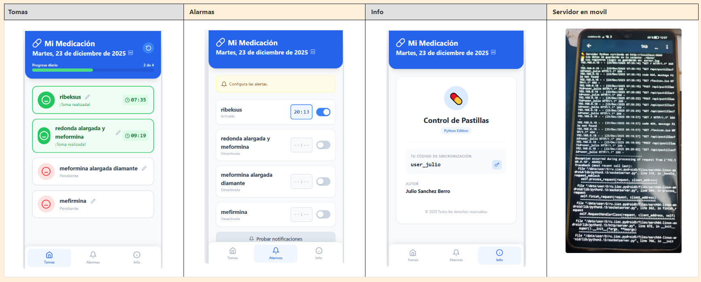

# Como usar la aplicación en un móvil antigüo  
------  
 Una forma excelente de reutilizar un móvil antiguo como servidor casero o simplemente para llevar tu aplicación contigo sin depender de internet.  
  
 Aquí tienes los pasos sencillos para hacerlo funcionar en Android:  

## Opción A: La forma fácil (Pydroid 3)  
----  
Esta app es un entorno de Python completo y fácil de usar.  
  
Descarga la App: Busca e instala "Pydroid 3" en la Google Play Store.  
  
**Prepara los archivos:**  
Crea una carpeta en tu móvil (por ejemplo, llamada MiPastillero).  
Copia dentro los dos archivos que hemos creado: server.py e index.html.  
**Abre el servidor:**  
Abre Pydroid 3.   
Pulsa el icono de la carpeta (arriba) > "Open" > Busca tu carpeta MiPastillero y selecciona server.py.  
**Ejecuta:**  
Pulsa el botón grande de "Play" (triángulo amarillo/blanco).  
Verás una pantalla negra (terminal) que dice:  💊 Servidor Python corriendo en http://localhost:8000.  
**Usa la App:**    
Abre tu navegador (Chrome, Firefox) en el móvil.  
Entra en: http://localhost:8000.  

## Opción B: Para usuarios avanzados (Termux)  
-----  
Si prefieres una consola real de Linux en tu móvil:    
Instala Termux desde F-Droid (recomendado) o Play Store.  
Escribe pkg install python y dale a Enter.  
Navega a la carpeta donde tengas los archivos (ej: cd /storage/emulated/0/Download/MiPastillero).  
Ejecuta: python server.py.  

## ¿Cómo conectarse desde otros dispositivos (PC o Tablet)?  
-----  
Si el móvil Android está haciendo de servidor y quieres ver la app en tu ordenador (conectados al mismo Wi-Fi):  
Averigua la IP local de tu móvil Android (en Ajustes > Wi-Fi > Tu red > Detalles). Suele ser algo como 192.168.1.XX.  
En el ordenador, escribe en el navegador: http://192.168.1.XX:8000 (cambiando las XX por el número real).  
-  _Nota:_ Para que esto funcione bien, tendrías que editar el index.html y cambiar API_URL poniendo la IP del móvil en lugar de localhost.   
    
**Importante:** Android suele cerrar las aplicaciones en segundo plano para ahorrar batería. Si vas a usar el móvil como servidor permanente, asegúrate de configurar Pydroid o Termux para que no se optimice la batería ("Battery Optimization: Unrestricted").  

## Captura de pantalla  
----  
  

